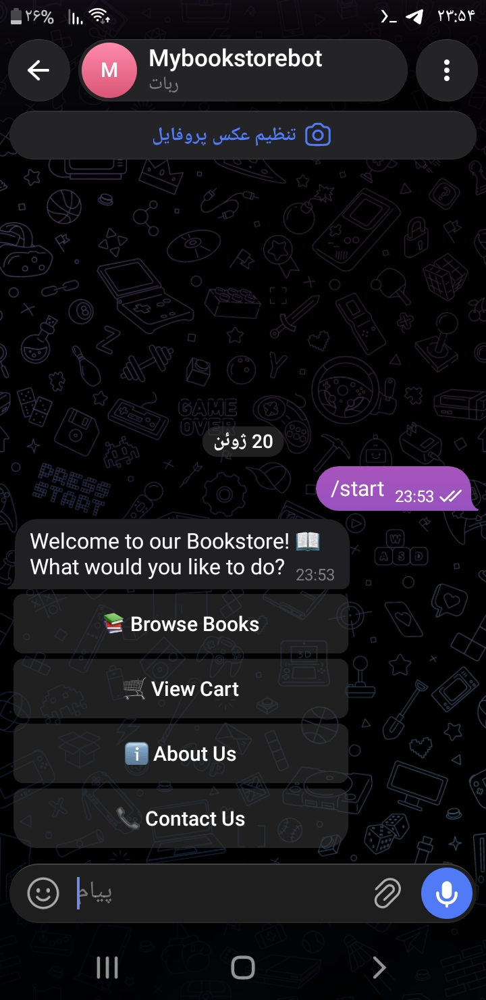
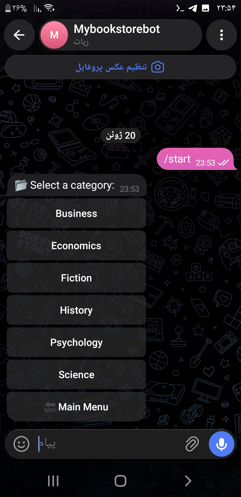
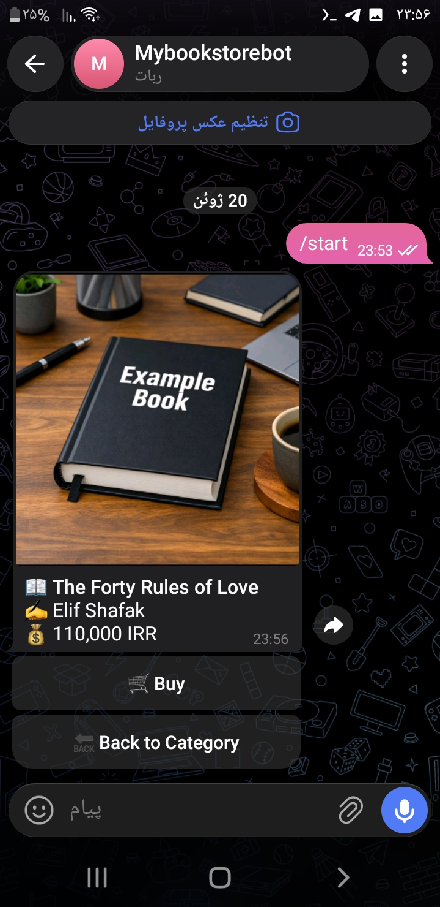
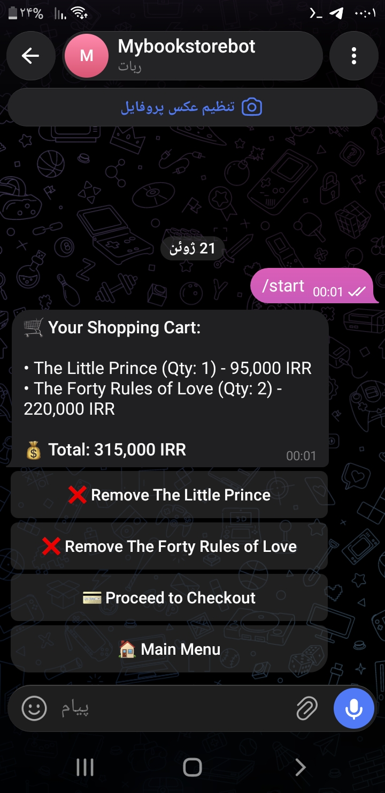
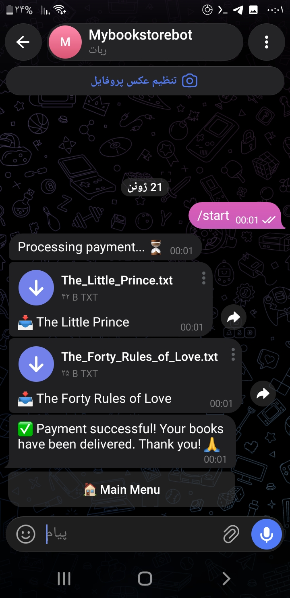

# 📚 Telegram Bookstore Bot

A fully functional Telegram bot simulating an online bookstore. Built with Python, python-telegram-bot, SQLite, and Pillow.

## ✨ Features

- Browse books by categories (Fiction, Science, History, etc.)
- View book details with cover image, author, and price
- Add to cart and manage cart
- Checkout simulation – delivers book files after payment
- Fully English interface with inline keyboards

## 🛠️ Technologies

- Python 3.12+
- python-telegram-bot v20+
- aiosqlite
- Pillow

## 🚀 How to Run

1. Clone the repository:
   ```bash
   git clone https://github.com/YOUR_USERNAME/bookstore-bot.git
   cd bookstore-bot
```

2. Install dependencies:
   ```bash
   pip install -r requirements.txt
   ```
3. Set your Telegram bot token:
   ```bash
   export BOT_TOKEN="your_telegram_bot_token"
   ```
4. Run the bot:
   ```bash
   python bot.py
   ```
5. Open Telegram, find your bot and send /start.


## 📷 Screenshots







